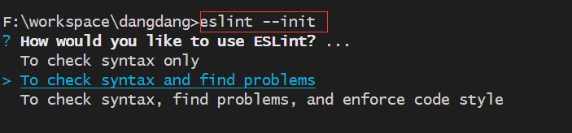
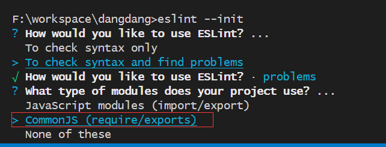
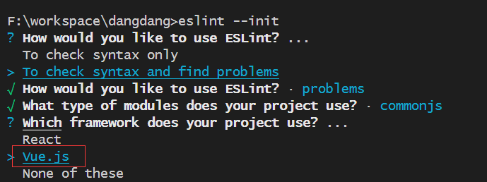

### 2-16 到 2-17  ESLint —ESLint——vite+ts 中的 10项 eslint 详解

**第一步： 安装 ESLint 相关依赖。**

```ts
npm install eslint@7.2.0 eslint-plugin-vue@7.20.0 vue-eslint-parser @typescript-eslint/parser @typescript-eslint/eslint-plugin -D
```

**第二步：初始化 ESLint，生成 eslintrc.js 默认规则。**

执行 npm run eslint --init  初始化命令。

选择 To check syntax and find problems 。



选择  CommonJS 规范。



选择 Vue.js 框架。



查看生成好的 eslintrc.js 文件，并追加以下验证规则。

```ts
module.exports = {
  // eslintrc.js文件所在的目录为root目录，
  //  eslint规则将对这个目录以及该目录下所有文件起作用。
  root: true,
  // 让vue3.2中的这些全局函数能正常使用。
  globals: {
    defineProps: 'readonly',
    defineEmits: 'readonly',
    defineExpose: 'readonly',
    withDefaults: 'readonly',
  },
  // eslint 继承别人写好的配置规则，这些规则是检测语法时的规则的来源。
  extends: ['plugin:@typescript-eslint/recommended'],

  // 插件的作用就是对规则进行补充，
  //如果 typescript-eslint/recommended 里面就没有包含与 vue 相关的规则,
  //那么就让 ESLint 兼容 vue 的语法.
  plugins: ['vue'],
  parser: 'vue-eslint-parser', //  检测 vue 语法规范 的 eslint 解析器。
  parserOptions: {
    // 发现尽管 ecmaVersion设置版本为5, 但 ESLint 依然能识别 ES6 的语法
    // 这是  '@typescript-eslint/parser' 解析器帮着识别了。
    ecmaVersion: 2021,
    parser: '@typescript-eslint/parser', // 检测 ts 语法规范的 eslint 解析器
  },
  rules: {
    //  生产环境不允许控制台输出，开发允许允许控制台输出。
    'no-console': process.env.NODE_ENV === 'production' ? 'warn' : 'off',
    'space-before-function-paren': 0, // 不允许函数的()前有空格
    'vue/no-multiple-template-root': 0,
    '@typescript-eslint/no-empty-function': 0, //允许出现空的函数
    '@typescript-eslint/no-explicit-any': [0], // 允许使用any
    '@typescript-eslint/no-var-requires': 0, // 项目中允许使用 require()语法。
    semi: 0, // 关闭语句结尾分号
    quotes: [2, 'single'], //使用单引号
    'prefer-const': 2, // 开启不变的变量一定要使用const
    '@typescript-eslint/no-unused-vars': 0, // 允许出现未使用过的变量
    '@typescript-eslint/no-inferrable-types': 0, //  允许变量后面添加类型
    '@typescript-eslint/no-non-null-assertion': 0,
  },
}
```

 第三步：package.json 文件，配置 ESLint 验证的哪些类型的文件。

```ts
"lint": "eslint --ext .ts --ext .vue  --ext js  src/
```

