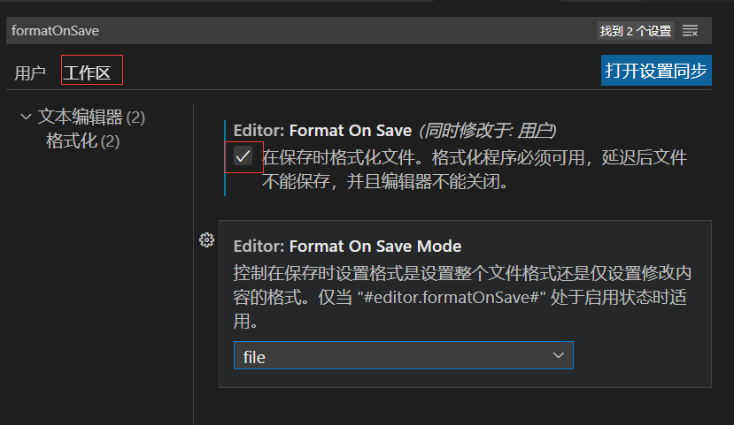
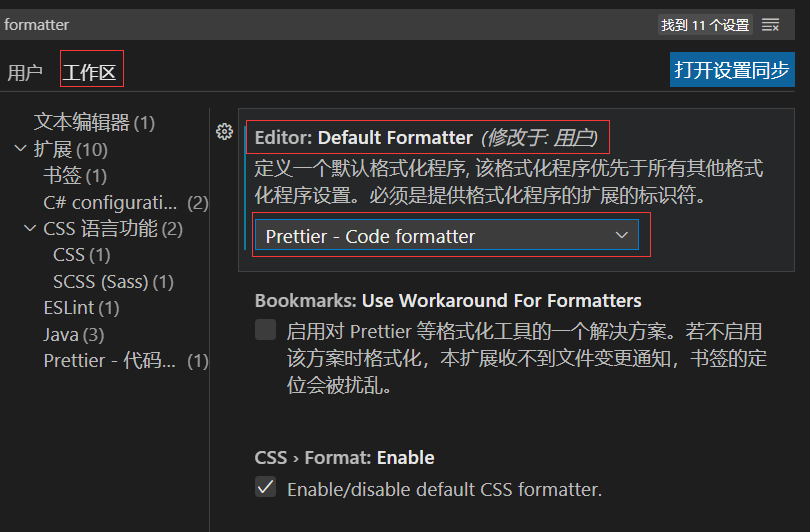

### 2-19 联合—Prettier +ESLint   结合

xxxxxxxxxx {  "compilerOptions": {    // ts 文件编译的 js 文件语法版本。     "target": "esnext",    // TS3.7 之后新增属性, 编译后的类属性转换为Object.defineProperty 声明，对于没有赋值的类属性也会编译出来。    "useDefineForClassFields": false,            "module": "esnext",            //  1 moduleResolution 模块解析    //  2 模块解析是 typescript 编译器用何种方式来确定导入所指内容。    //  moduleResolution："node" =>采用 node 模块解析的方式查找文件。[从内层到最高目录的外层查找 import 引入的文件]    // moduleResolution："classic" => 采用 classic 模块解析的方式查找文件。[从外层到内层方式查找 查找 import 引入的文件]    "moduleResolution": "node",            // 通过 tsc 编译后输出目录。    "rootDir": "./src", // 指定 TS 要编译的 TS 文件 源目录    "outDir": "./tsbuild", //  通过 tsc 编译后的TS 文件输出目录。            //  是否允许导入 js 文件。    "allowJs": true,    //  编译后是否生成 d.ts文件    "declaration": true,            // 开启严格模式    "strict": true,    // 在 vue 中支持 类似 react jsx的语法格式。    "jsx": "preserve",            // ts编译后的js文件中生成Map文件      "sourceMap": true,    "baseUrl": ".",    // 是否可以导入json文件。    "resolveJsonModule": true,            // export 接口或者type类型 会出现错误。    "isolatedModules": true,            //  有些依赖库底层 为了兼容CommonJs规范、AMD规范这二者的规范中相互兼容，使用了 export =，将二者规范统一。"esModuleInterop":true表示允许依赖库中出现export = 这种兼容规范导出的格式，TS 可以用import from导入    "esModuleInterop": true,            // 允许访问的底层依赖库    "lib": ["esnext", "dom"],     // 对声明文件不进行类型检查    "skipLibCheck": true,            "paths": {      "@/*": ["src/*"]    }  },  // ts 编译器编译覆盖的范围。  "include": ["src/**/*.ts", "src/**/*.d.ts", "src/**/*.vue", "./vite.config.ts"]}ts

Prettier  按照 ESLint 规则来格式化代码的工具，但 Prettier 有默认规则，也可以定义规则。当规则和 ESLint规则冲突时，Prettier会优先使用自己的规则。 特点：开箱即用。

**操作步骤：**

第一步：安装  Prettier - Code formatter。

第二步：settings 设置，勾选 Format On Save。




第三步：settings 设置，设置默认的格式化工具为 Prettier。



第四步： 使用 Prettier 来 按照 ESLint 规则来格式化代码。

```ts
{
  "semi": false, /* 不加分号*/
  "tabWidth": 2, /* 缩进2个空格*/
  "singleQuote": true,/* 单引号*/
  "printWidth":100
}
```

