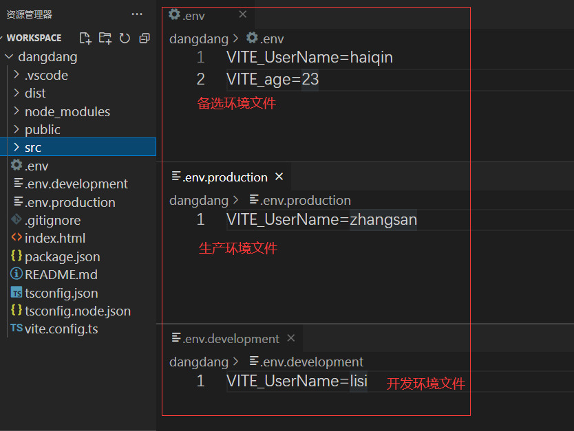

### 2-2 环境变量—vite env 环境变量

 **1.  问： 如何查看 vite 环境变量**。

     答： 使用 import.meta.env 

**2.  import.meta.env  有 5 个环境变量。**

    BASE_URL：     开发或生产环境服务的公共基础路径。
    DEV：true：    当前环境是否为开发环境，true 表示开发环境。
    MODE:         应用运行的模式。分为 开发环境模式( development )，生产环境模式（production）。
    PROD：false:  当前环境是否为生产环境，true 表示生产环境。
    SSR:  false： 是否为服务器渲染。


**3.  问：如何查看生产环境？**

   第一步：在 package.json 中 script  build选项后追加 --open

   第一步： 终端  执行 cnpm run build 打包项目 。

   第二步：执行 cnpm run preview 运行打包项目。

   第三步：进入浏览器查看生产环境变量。

**4.  自定义环境变量**

第一步：在根目录下新建 .env，.env.development， .env.production 三个环境文件。

.env.production      表示生成环境下的文件。

.env.development   表示开发环境下的文件。

.env     		        表示备选环境文件。

注意：vite只处理以 VITE 开头的环境变量。

附图1：环境文件。




附图2：调用环境文件环境变量。


 附图3：查看开发环境下的环境变量。


附图4：生产环境下的环境变量。


5. 在 package.json 文件 明确 **环境变量和生产环境**。

```json
  "scripts": {
    "dev": "vite --mode development --open",
    "build": "vite build --mode production --open",
    "preview": "vite preview   --open"
  },
```
