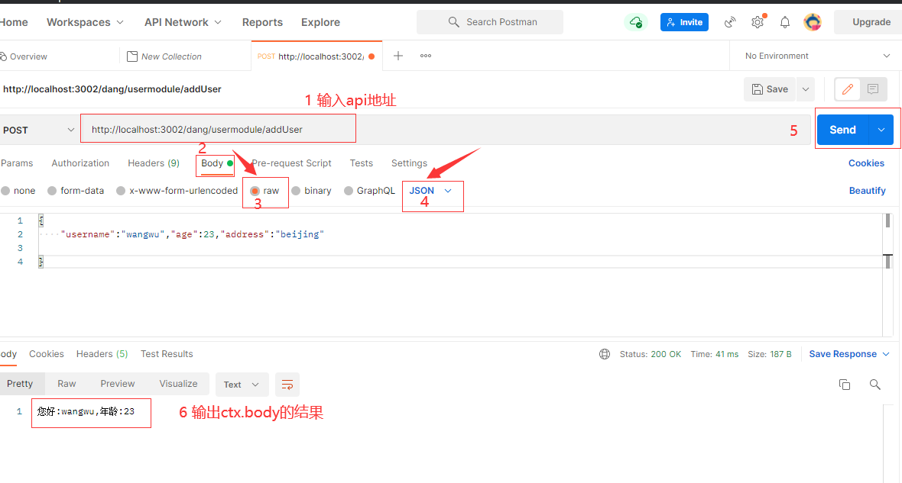

# 3-10 路由实现—用户二级路由，路由请求实现

**1. 创建用户路由：【先按常规方式编写，后面逐步升级】**

```ts
import { Context } from 'koa'
import Router from 'koa-router'

const router = new Router()

router.prefix('/usermodule')

router.get('/findUserinfo/:username', async (ctx: Context) => {
  const { username } = ctx.params;
  ctx.body = `您好：${username}`
})

export default router
```

**2. 在 app.ts 中追加二级路由**

```ts
import Koa from 'koa'
import body from 'koa-body'
import json from 'koa-json'
import Router from 'koa-router'
import useRouter from './router/userrouter'
const app = new Koa()
const router = new Router()
router.prefix('/dang') //为所有的路由访问添加路由前缀/dang，来作为一级路由

router.get('/test', async (ctx: Koa.Context) => {
  ctx.body = '第一个测试页面'
})
router.use(json()) // 格式化 json 数据
router.use(body()) // 支持post请求

// 一级路由加载二级路由
router.use(useRouter.routes(), useRouter.allowedMethods())
//  加载路由到全局路由上
app.use(router.routes())
app.listen(3002)
console.log('server running on port 3002')
```

**3. Post 请求实现。**

```ts
import { Context } from 'koa'
import Router from 'koa-router'

const router = new Router()

router.prefix('/usermodule')

router.get('/findUserinfo/:username', async (ctx: Context) => {
  const { username } = ctx.params;
  ctx.body = `您好：${username}`
})

router.post('/addUser', async (ctx: Context) => {
  const user = ctx.request.body
  ctx.body = `您好:${user.username},年龄:${user.age}`
})

export default router
```

4 postman 测试 post 请求。


