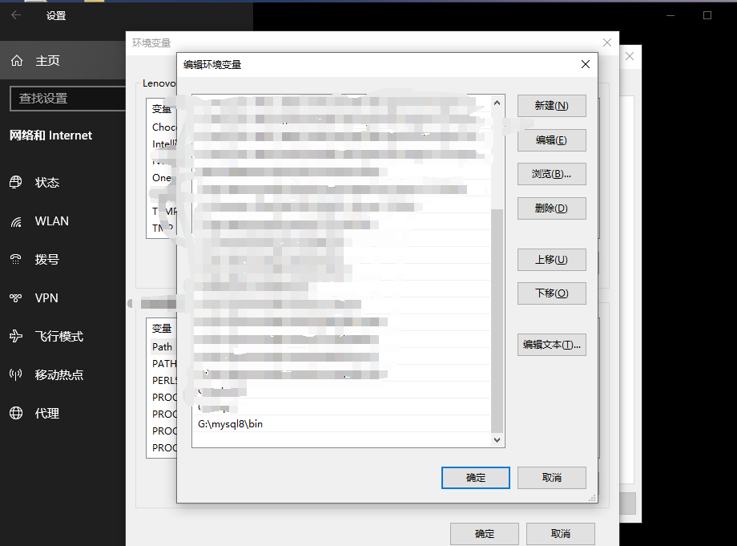
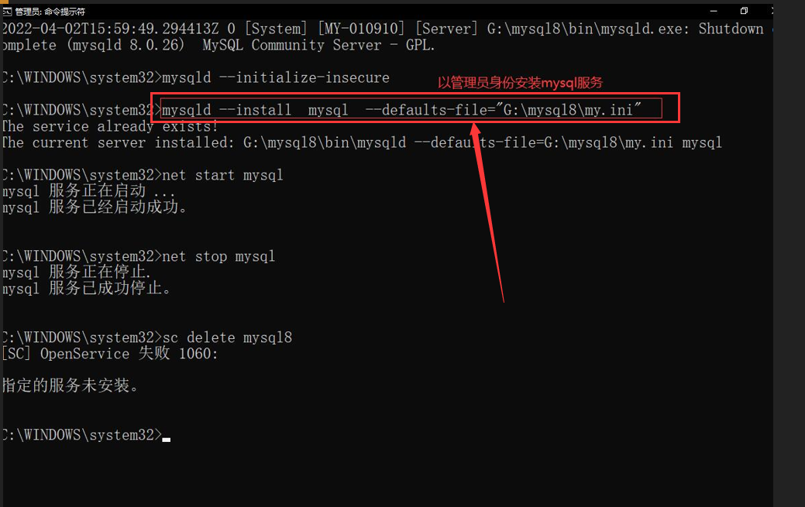
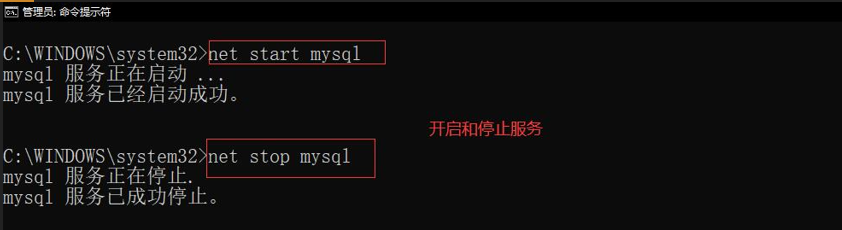

# 3-2 安装 MySql 数据库

操作系统：win10

**如果之前电脑安装过 mysql 8 以上的版本，无需重装。**

第一步：解压 mysql-8.0.28-winx64 （选择几百MB的那个大的msi包，下载后安装选择仅安装mysql就行了）

第二步：解压根目录下新建 my.ini 文件

第三步：打开 my.ini 文件，修改如下：

第四步: 修改环境变量

首先：找到设置，选择环境变量。

 选择环境变量

 找到Path 

添加环境变量 【你的mysql 解压目录下的bin目录】

初始化 data 目录

操作：管理员身份进入 cmd ，进入到mysql的安装目录中，输入mysqld --initialize-insecure（生成data文件夹，这个文件夹一定不要手动生成，要依靠这个指令去生成）

在 管理员身份的 cmd 中 安装 mysql 服务, 服务名为 mysql 

命令：mysqld --install mysql --defaults-file="G:\mysql8\my.ini"

mysqld --install mysql --defaults-file="D:\mysql\my.ini"

查看安装成功的服务

开启 mysql 服务

