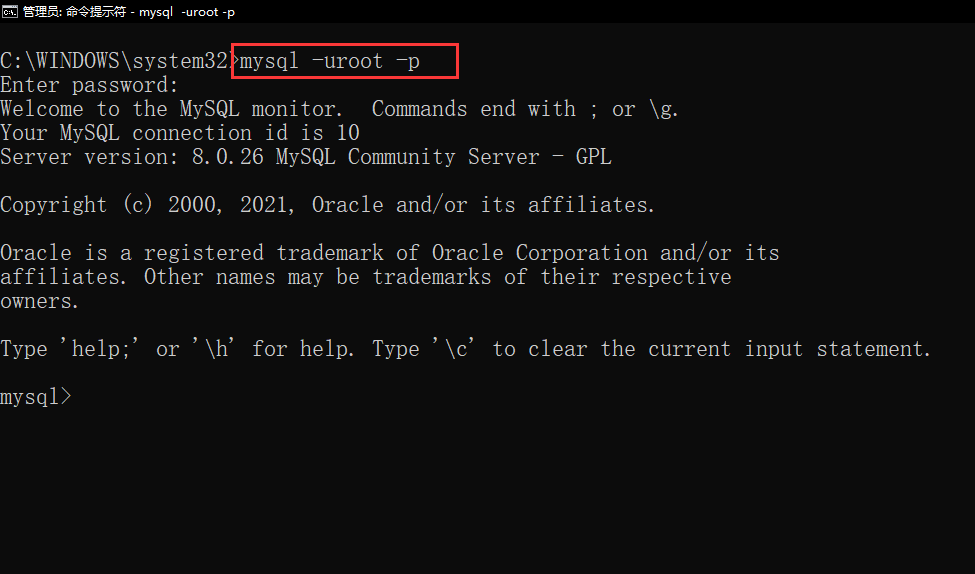

# 3-3 mysql 登录，新建用户，分配权限

 **root 用户登录，默认无密码，直接回车即可登录成功。**

这时候cmd上就显示已经进入到了mysql的操作界面

show databases;   查看数据库，注意一定要有英文分号结尾

我们不要用默认的root用户，而是想自己创建一个新的用户

**新建用户, 统一新建 admin  密码 123456** 

create user 'admin' identified with mysql_native_password by '123456'

回车之后再打一个分号，然后再回车，界面提示”Query OK，0 rows affected(0.60 sec)“

quit; 退出mysql操作环境，然后mysql -uadmin -p 进入刚创建的自己的账号操作界面中

create database one; 创建一个叫one的数据库，界面提示无权限：

Access denied for user 'admin'@'%' to database 'one'

**在 root 用户下 为 admin 分配权限**

~~~
grant all privileges ON  *.* TO  admin@'%'
;
~~~

(语句意思：把所有的权限都赋给admin，admin的密码是任意的)

