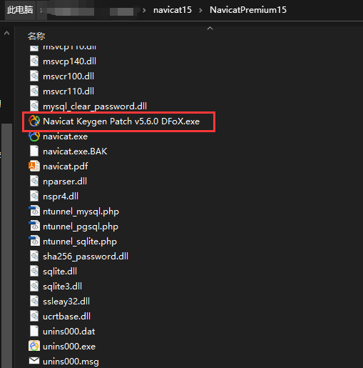
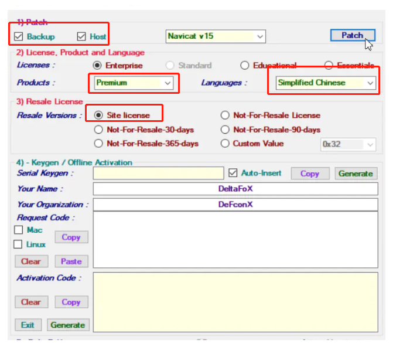
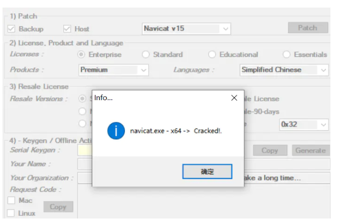
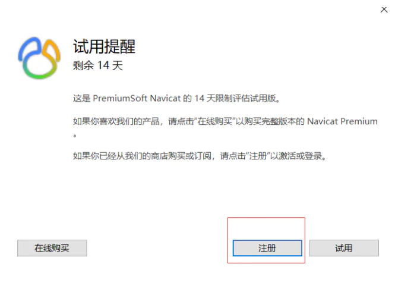
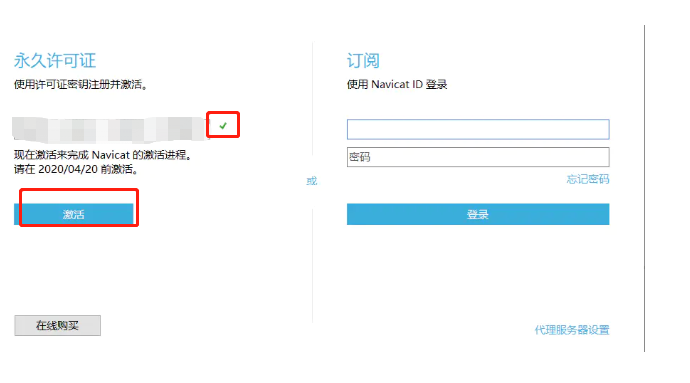
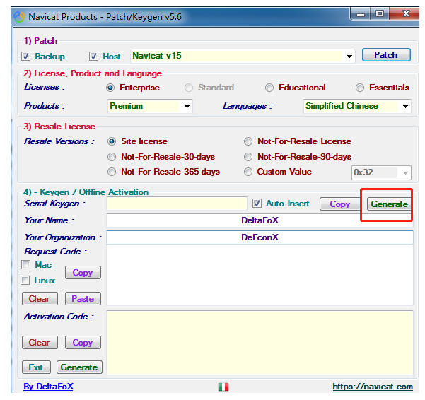

# 3-7 安装Navicat 工具

安装完成后需要破解

1. 将激活工具 Navicat Keygen Patch v5.6.0 DFoX 复制到Navicat的安装路径。

2  以 管理员身份运行 激活工具Navicat Keygen Patch v5.6.0 DFoX，点击“Patch”

几秒钟后会有弹出框提示，点击“确定”（点击确定后不用关闭此软件窗口，一会儿注册要用）

**3 打开 Navicat，选择“注册”**

**（如果已经打开，可在工具栏中选择“帮助”-->“注册”也可以）**

4. 点击注册后，进入到激活界面

5 . 找到 第2步的激活工具，点击 "generate"

6 生成的秘钥手动填充到 第4步中的激活窗口的秘钥栏中。

新建链接，选择mysql

命令行链接方式：

mysql -h localhost -P 3306 -uadmin -p

如果是部署连接别的ip的，则把localhost换成对应的ip就行
